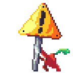

    
        <h1 style="display: inline;">Hi!</h1>
        <h3>You can also find me here:</h3>
        
        
        
        
        <h4></h4>
    

# [Compendium](https://github.com/vega-star/compendium)

Compendium is a portifolio with a multitude of source-available projects stored as submodules, where you can search, find, and thinker with personal projects made by me! These can range from basic infrastrucutre code examples to fully built functioning games. You're more than welcome to check it out!

# GitHub Activity

 
     
    

# Additional Info

>[!NOTE]
>This dashboard is being under construction. If you like what you see, it will only get better!

